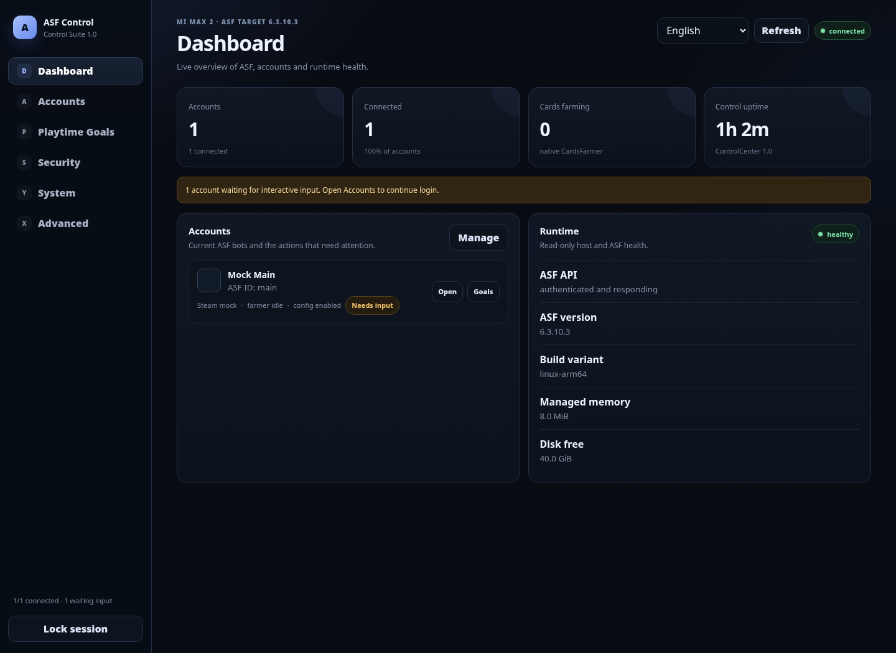
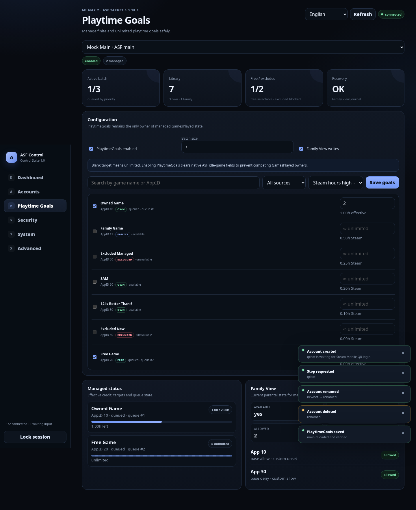
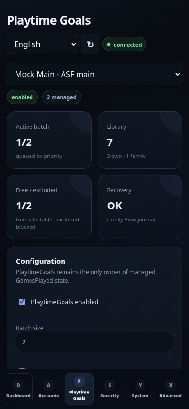
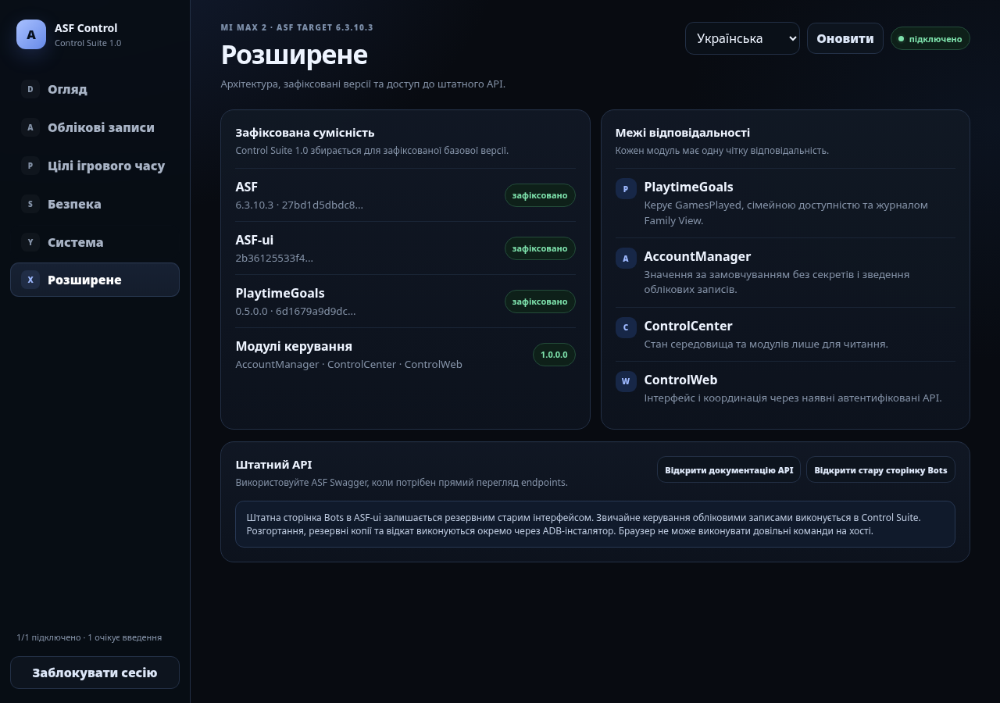
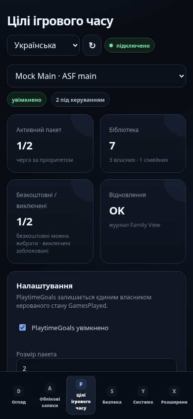

# ASF Control Suite

### Native account control, web UI and playtime automation for ArchiSteamFarm

  
  
  

**One self-hosted Control Suite UI at `/` · ASF-native APIs · reproducible releases · RAM-only IPC credentials**

[Installation](docs/installation/manual.md)
&nbsp;·&nbsp;
[Security](SECURITY.md)
&nbsp;·&nbsp;
[Release notes](docs/RELEASE_NOTES.md)

[English](README.md) · [Українська](README.uk.md) · [Deutsch](README.de.md)

  

---

## Overview

ASF Control Suite adds a unified control layer to
[ArchiSteamFarm](https://github.com/JustArchiNET/ArchiSteamFarm)
while keeping ASF itself authoritative for authentication, bot lifecycle and configuration.

No second daemon. No arbitrary shell API. No separate credential database.

| Module | Purpose |
| --- | --- |
| **AccountManager** | Multi-account overview, Steam profiles, bot controls and QR/password onboarding |
| **ControlCenter** | Runtime health, module status and compatibility metadata |
| **ControlWeb** | Responsive self-hosted Control Suite interface; `/` is the default entrypoint and `/Control/` remains canonical internally |
| **PlaytimeGoals** | Per-game playtime targets, queues, FREE-license handling and Family View recovery |

## Preview

<table>
  <tr>
    <td width="62%">
      
    </td>
    <td width="38%">
      
    </td>
  </tr>
  <tr>
    <td align="center"><strong>Desktop</strong></td>
    <td align="center"><strong>Mobile</strong></td>
  </tr>
</table>

<strong>Ukrainian interface</strong>

 

<table>
  <tr>
    <td width="62%">
      
    </td>
    <td width="38%">
      
    </td>
  </tr>
</table>

## Installation

ASF Control Suite **v1.0.0** is published as the first stable release.

Download the verified release from [GitHub Releases](https://github.com/M0npet/asf-control-suite/releases/tag/v1.0.0).
For installation, checksum verification, pinned-source builds and rollback,
see the [installation guide](docs/installation/manual.md).

## Highlights

- **ASF-native authentication** — ASF IPC remains authoritative.
- **RAM-only IPC password** — credentials are never persisted to browser storage.
- **Responsive UI** — desktop and mobile layouts.
- **Self-hosted assets** — CSS, JavaScript and QR rendering stay local.
- **Pinned supply chain** — ASF, ASF-ui, PlaytimeGoals and .NET SDK revisions are explicit.
- **Verified release provenance** — archives are checked against canonical build output, including the audited ASF compatibility patch.
- **Transactional deployment** — validation, backup, verification and rollback support.

## Compatibility

The canonical source of truth is [`release/pins.env`](release/pins.env).

| Component | Version |
| --- | --- |
| ASF Control Suite | **1.0.0** |
| Control modules | **1.0.0.0** |
| ArchiSteamFarm | **6.3.10.3** |
| PlaytimeGoals | **0.5.2.0** |
| .NET SDK | **10.0.400** |

Pinned revisions:

- ASF: `27bd1d5dbdc8c4897eaaed0e3246d10ffe18b0ad`
- ASF compatibility patch SHA-256: `42026758d985ea54b635bc42b72b5f715369b01e9d19bbed61d576cd57020fcf`
- ASF-ui: `2b36125533f41e624b2fdcdec44f37ad60c7daaa`
- PlaytimeGoals: `afe080fb5dae505f3b4f7537b08782dda35a260b`

## Release policy

Stable releases are published only from provenance-verified artifacts tied
to an exact Control Suite commit and the canonical dependency pins.

Release **v1.0.0** is pinned to commit
`15314163bfccd26207fe9c1e3a8504727fea2910`. The release pipeline verifies
checksums and byte identity before publication. Standalone PlaytimeGoals
release ownership remains separate.

## Security

The IPC password exists only in JavaScript **page memory** for the
authenticated page.

It is cleared on refresh, lock, logout, authentication rejection or page
close and is not stored in `localStorage` or `sessionStorage`.

Steam passwords are encrypted through ASF before BotConfig persistence.

ControlWeb exposes no arbitrary shell/process execution API.

See [SECURITY.md](SECURITY.md).

## Testing

Run the complete local suite:

    bash tests/run-all.sh

The suite covers:

- release pin integrity
- generated build metadata
- RAM-only authentication
- .NET SDK supply-chain validation
- native ZIP layout
- byte identity
- release provenance
- browser integration
- transactional phone installation and rollback

## Repository layout

    src/          ASF plugin source
    patches/      audited patches applied to the pinned ASF source
    release/      canonical release pins
    scripts/      build, packaging and deployment tools
    installer/    transactional phone deployment
    tests/        contract and integration tests
    docs/         user and developer documentation

## Documentation

- [Installation](docs/installation/manual.md)
- [Architecture](docs/architecture/README.md)
- [Development](docs/development/README.md)
- [Function matrix](docs/FUNCTION_MATRIX.md)
- [Release notes](docs/RELEASE_NOTES.md)
- [Test report](docs/TEST_REPORT.md)
- [Security policy](SECURITY.md)
- [Contributing](CONTRIBUTING.md)
- [License](LICENSE)

---

**ASF Control Suite**

ASF-native APIs · explicit security boundaries · reproducible releases

## Native ASF compatibility

Control Suite keeps the complete stock ASF-ui reachable for native bot configuration, commands, logs, mass editing, plugin/release management and other upstream ASF functions. Common settings such as Steam persona status (including Invisible) are also exposed directly in the account workspace.

PlaytimeGoals 0.5.2 uses second-precision local deadlines for finite targets while retaining Steam's minute-granularity historical playtime as the authoritative starting baseline.
